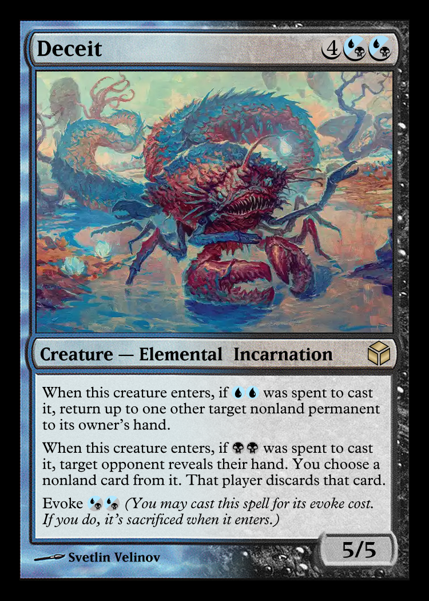

# Magic Set Editor (MSE) Styles

## Installation

1. Download or clone the repo.
2. Dragging and dropping the unzipped folders directly into your Magic Set Editor `data` directory (usually located in `C:\Program Files\Magic Set Editor\data\` or your user documents folder).

## 2003 Frame High Resolution Template

The classic **2003 card frame** (Modern border design introduced in _8th Edition_ and used through _Magic 2014_).This template allows you to design and generate custom Magic: The Gathering cards featuring the iconic look of the 2003-2014 era.

### Features

- **Full Color Support:** Includes frames for White, Blue, Black, Red, Green, Multicolored, Artifacts, Lands, and Colorless cards.
- **Single Color Artifacts:** Supports artifacts with single color.
  - By setting `Artifact blending` to `Yes` in the `Style` tab.
- **Dual Color Hybird Artifacts:** Supports artifacts with dual colors.
  - By setting `Artifact blending` to `Yes` in the `Style` tab.
  - Check `multicolor` in the card to make power/toughness box golden color.
- **Devoid:** Supports Devoid cards.
  - By setting `Image size` to `Void_colorless` in the `Style` tab.
- **Alpha Hybrid:** Supports Alpha land hybrid blend.
  - By setting `Image size` to `Alpha_land` in the `Style` tab.
- **Extended Art:** Supports cards with Extended Art.
  - By setting `Image size` to `Extended` in the `Style` tab.

* Note: Setting the `Image size` to `Extended` or `Void_colorless` expands the image frame to cover the entire card, which prevents you from editing text fields directly; switch the `Image size` back to `Standard` whenever you need to edit your card data.

### Preview

Here is a look at what cards generated with this template look like:

## License

MIT
